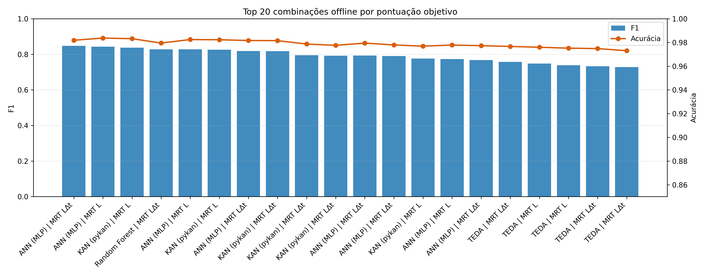
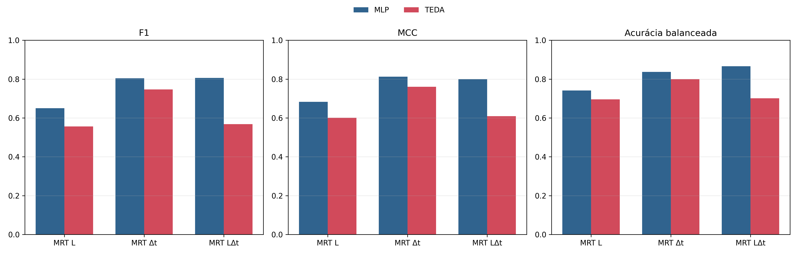
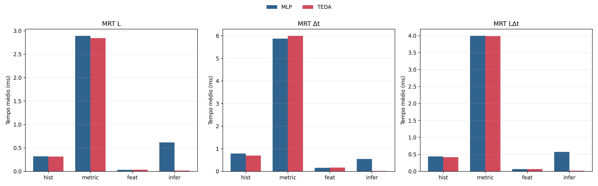

&nbsp;
&nbsp;
<p align="center">
  
</p>

&nbsp;

# Modelagem de Tráfego de Redes Industriais com Matrizes de Recorrência Temporal e Aprendizado de Máquina para Detecção de Anomalias

### Autores: [Morsinaldo Medeiros](https://github.com/Morsinaldo), [Dennins Brandão](https://scholar.google.com/citations?user=OxSKwvEAAAAJ&hl=pt-BR), [Marianne Silva](https://github.com/MarianneDiniz) e [Ivanovitch Silva](https://github.com/ivanovitchm)

## 1. Resumo

Redes de comunicação industrial frequentemente exibem padrões de comunicação repetitivos devido a processos cíclicos de controle e monitoramento, e desvios desses padrões podem indicar falhas ou comportamento anormal do sistema. Este trabalho propõe uma abordagem agnóstica a protocolos para detecção de anomalias baseada na modelagem de padrões de recorrência no tráfego de rede usando o comprimento do pacote e o tempo entre chegadas, representados por Matrizes de Recorrência Temporal calculadas em janelas deslizantes. As mudanças entre matrizes consecutivas são quantificadas para gerar vetores de características compactos, que são usados para detecção de anomalias com modelos de aprendizado de máquina. Experimentos conduzidos em um conjunto de dados PROFIBUS com injeção controlada de anomalias mostraram que a representação proposta suporta a detecção de anomalias, com perceptrons multicamadas alcançando as maiores pontuações F1 e a representação combinada fornecendo o melhor desempenho geral. O pipeline de processamento completo também foi implementado em uma plataforma de microcontrolador, e os tempos de execução medidos indicaram que o método pode ser executado em dispositivos de borda no cenário avaliado.

## 2. Estrutura do Repositório

O estado atual do repositório é o seguinte:

```bash
CBA2026-MRT-Anomaly-Detection
├── data/
│   └── raw/
│       └── data_1.csv
├── figures/
│   ├── all_models.png
│   ├── arduino_print.png
│   ├── conecta_logo.png
│   ├── embedded_results.png
│   ├── embedded_stage_times.png
│   └── mlp_execution.png
├── notebooks/
│   ├── embedded_best_models_analysis.ipynb
│   ├── mrt_composite.png
│   ├── mrt_idle.png
│   ├── mrt_len.png
│   └── train_all_models.ipynb
├── outputs/
│   ├── article_case_study_final/
│   │   └── resultados_globais_modelos.csv
│   ├── best_mlp_offline/
│   └── best_teda_offline/
├── src/
│   ├── teda.py
│   └── trm_experiments.py
├── requirements.txt
└── README.md
```

## 3. Ambiente

Recomenda-se usar Python 3.11 ou 3.12 em um ambiente virtual limpo.

```bash
conda create --name trm python=3.11
conda activate trm
git clone https://github.com/conect2ai/CBA2026-MRT-Anomaly-Detection.git
cd CBA2026-MRT-Anomaly-Detection
pip install -r requirements.txt
```

Para abrir os notebooks interativamente:

```bash
cd notebooks
jupyter lab
```

Os notebooks assumem execução a partir da pasta `notebooks/`, pois os caminhos relativos para `../data`, `../outputs` e `../src` dependem disso.

## 4. Dados

O conjunto de dados bruto usado nos experimentos está em:

```bash
data/raw/data_1.csv
```

Esse arquivo é o traço principal usado no notebook de treinamento offline. Os resultados embarcados já processados estão em:

```bash
outputs/best_mlp_offline/
outputs/best_teda_offline/
```

Essas pastas contêm os logs e rótulos capturados para comparar a execução dos melhores modelos offline em ambiente embarcado.

## 5. Reprodução dos Experimentos

### 5.1 Treinamento offline completo

Notebook:

```bash
notebooks/train_all_models.ipynb
```

Esse notebook executa o pipeline completo de estudo offline:

- leitura do CSV bruto;
- construção das MRTs para `len`, `idle` e `composite`;
- montagem dos subconjuntos de atributos dos protocolos `legacy` e `current`;
- treinamento e avaliação de TEDA, Isolation Forest, One-Class SVM, Random Forest, XGBoost, MLP e KAN;
- exportação consolidada dos resultados para `outputs/article_case_study_final/resultados_globais_modelos.csv`.

### Métricas de quantificação de diferença entre matrizes

- `js`
- `fro`
- `rare`
- `cos`
- `euclid`
- `avg_pool`
- `d_js`
- `d_fro`

### Significado dos atributos do protocolo `current`

| Atributo | Significado |
| --- | --- |
| `js` | Distância de Jensen-Shannon entre MRTs consecutivas |
| `fro` | Distância de Frobenius entre MRTs normalizadas consecutivas |
| `rare` | Variação absoluta da massa em regiões raras/de alto atraso |
| `cos` | Distância do cosseno entre MRTs consecutivas achatadas |
| `euclid` | Distância Euclidiana entre MRTs consecutivas achatadas |
| `avg_pool` | Diferença média absoluta entre MRTs normalizadas consecutivas |

### Resultado consolidado atual

O CSV atual possui **294 linhas**, correspondendo às combinações avaliadas no estado presente do notebook:

```bash
outputs/article_case_study_final/resultados_globais_modelos.csv
```

### Top 5 resultados offline por `objective_score`

| Rank | Modelo | Representação | Protocolo | Subconjunto | F1 | MCC | Objective Score |
| --- | --- | --- | --- | --- | ---: | ---: | ---: |
| 1 | ANN (MLP) | `composite` | `legacy` | `legacy_mv` | 0.8477 | 0.8381 | 1.0737 |
| 2 | ANN (MLP) | `len` | `legacy` | `legacy_mv` | 0.8433 | 0.8455 | 1.0597 |
| 3 | KAN (pykan) | `len` | `legacy` | `legacy_mv` | 0.8369 | 0.8402 | 1.0521 |
| 4 | Random Forest | `composite` | `legacy` | `legacy_mv` | 0.8275 | 0.8167 | 1.0503 |
| 5 | ANN (MLP) | `len` | `legacy` | `legacy_univar_fro` | 0.8282 | 0.8328 | 1.0416 |

### Melhor configuração por família de modelo

| Modelo | Representação | Protocolo | Subconjunto | F1 | MCC | Objective Score |
| --- | --- | --- | --- | ---: | ---: | ---: |
| ANN (MLP) | `composite` | `legacy` | `legacy_mv` | 0.8477 | 0.8381 | 1.0737 |
| Isolation Forest | `composite` | `legacy` | `legacy_mv` | 0.4664 | 0.4425 | 0.6382 |
| KAN (pykan) | `len` | `legacy` | `legacy_mv` | 0.8369 | 0.8402 | 1.0521 |
| One-Class SVM | `idle` | `current` | `current_pair_cos_euclid` | 0.6547 | 0.6850 | 0.8406 |
| Random Forest | `composite` | `legacy` | `legacy_mv` | 0.8275 | 0.8167 | 1.0503 |
| TEDA | `composite` | `legacy` | `legacy_mv` | 0.7572 | 0.7710 | 0.9583 |
| XGBoost | `composite` | `legacy` | `legacy_mv` | 0.7096 | 0.7013 | 0.9257 |

### Leitura rápida dos resultados offline

- As melhores combinações continuam concentradas no protocolo `legacy`, em especial no subconjunto `legacy_mv`.
- O melhor resultado global atual é do **MLP com MRT composta**.
- Entre os métodos não supervisionados, o **TEDA** é o mais competitivo no protocolo `legacy`, enquanto o **One-Class SVM** se destaca no protocolo `current`.

<p align="center">
  
</p>

### 5.2 Análise dos melhores modelos em ambiente embarcado

Notebook:

```bash
notebooks/embedded_best_models_analysis.ipynb
```

Esse notebook:

- carrega os artefatos de `outputs/best_mlp_offline` e `outputs/best_teda_offline`;
- resolve duplicatas, priorizando arquivos marcados como `rerun`;
- recompõe as métricas a partir dos logs;
- compara qualidade de detecção e custo temporal em dispositivo.

### Resumo atual dos resultados embarcados

| Modelo | Melhor representação por F1 | F1 | MCC | Acurácia balanceada | FAR | Tempo médio total |
| --- | --- | ---: | ---: | ---: | ---: | ---: |
| MLP | `composite` | 0.8058 | 0.7997 | 0.8658 | 0.0053 | 5090.6 us |
| TEDA | `idle` | 0.7465 | 0.7608 | 0.7997 | 0.0004 | 6893.6 us |

### Observações sobre a execução embarcada

- O **MLP composto** entrega o melhor F1 geral entre os logs embarcados disponíveis.
- O **TEDA em `idle`** apresenta o melhor equilíbrio embarcado para essa família.
- A representação `len` é a mais barata em tempo médio total para ambos os modelos, mas perde em qualidade.

<p align="center">
  
</p>

<p align="center">
  
</p>

## 6. Figuras auxiliares das representações MRT

As figuras abaixo são usadas para ilustrar as três representações avaliadas no estudo e estão disponíveis em `notebooks/`:

- `notebooks/mrt_len.png`
- `notebooks/mrt_idle.png`
- `notebooks/mrt_composite.png`

## 7. Implementação Python

Os componentes principais usados pelos notebooks estão em `src/`:

- `src/teda.py`: implementação do algoritmo TEDA usado nos experimentos;
- `src/trm_experiments.py`: utilitários de avaliação, divisão temporal e métricas auxiliares.

## 8. Estado de Execução Verificado

Durante a revisão desta documentação, foram validados os seguintes pontos:

- o `README` foi alinhado aos arquivos que realmente existem no repositório;
- as figuras de resultados em `figures/` foram regeneradas com base nos CSVs atuais;
- o notebook `embedded_best_models_analysis.ipynb` foi corrigido para não falhar quando `seaborn` não estiver instalado;
- os notebooks foram inspecionados e revalidados no fluxo atual do projeto.

## Licença

Este projeto está licenciado sob a licença MIT.

## Sobre o Conect2AI

O **Conect2AI** é um grupo de pesquisa da **Universidade Federal do Rio Grande do Norte (UFRN)** voltado à aplicação de Inteligência Artificial e Aprendizado de Máquina em áreas como:

- inteligência embarcada;
- Internet das Coisas;
- sistemas de transporte inteligentes.

Website: [http://conect2ai.dca.ufrn.br](http://conect2ai.dca.ufrn.br)
